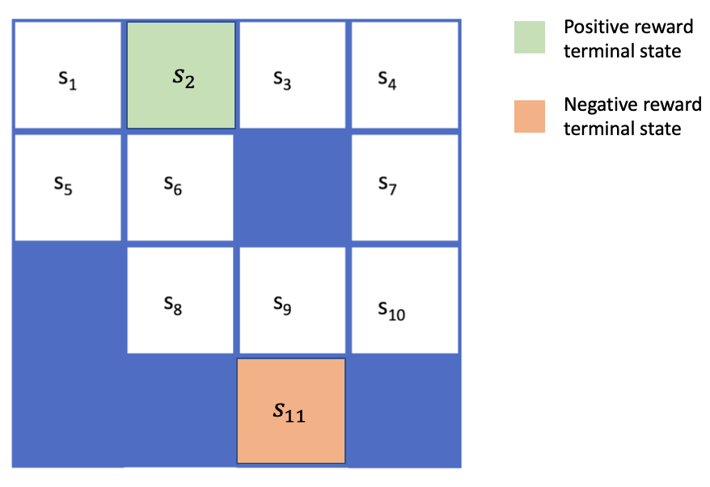

# RL-Markov-Decision-Process-and-Grid-World

The goal of this project was to explore Grid World and solving for the optimal policy and value function at each states.

The Grid World of interest was a 4x4 grid, with state [0, 1] and [3, 2] as positive and negative reward states. The positions [1, 2], [2, 0], [3, 0], [3, 1], and [3, 3] were blocked, as shown in the image below.

Any move towards a state which is not terminal brings a reward of -1, whilst reaching the positive and negative termnial state provides rewards of 10 and -100 respectively. 
The agent could move in 4 different directions: North, South, East, West, and would stay in place (whilst still recieving the -1 reward) if its action led it out of the grid or to a blocked state.

The repository is as follows:

mdp_gridworld.py contains the annotated code which solves this problem.   
Notebook_to_run shows how to use the main code an provides the solution to this problem.
